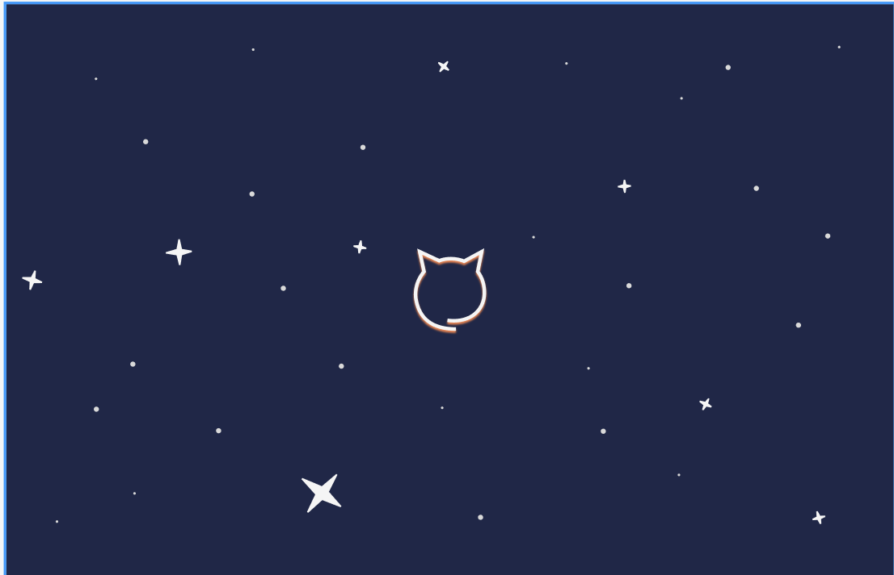

"# CalistoWebsite" 

### IDEA:
First, I think I need something like a lead on. I have to think of where the user would want to start, which is not necessarily going to be the beggining. Something like a big bang effect would be cool, where a user starts with a mostly empty screen with a button "click here" (or a cat icon) and once they do the animation of stars expanding will start that will last about 3 seconds, with the website staying in meteor shower animation after.
However, the obvious question is where would calisto fit?
I think a slow revealing effect of her pictures with her being in the center would be nice.

After working in Figma this is what I came up with as the original screen:

Maybe I should add some sort of hymn when the page loads to add immersiveness. I also think I should make the stars hover a bit, which I don't think will be a big issue, as I will just give them one class.

-----------------------------------------------------
## Star Background and Animation

For the star Idea, after experimenting and trying out some things I have come to a satisfiable solution:
To create a stary background, I will make a new function in JS that will generate multiple box-shadows at random positions and then apply that to my website. The idea for using box-shadows I got from the website CodePen from one of the posts. Its a great idea as we are not actually creating any new DOMS and hence will not be overloading the website, but just adding multiple styles onto one "< div >".
I'll then add animations to make the the sky breathe.

I realized in the process of making the desiarable animation for the stars that it is a lot more complicated than I have thought. In the process of trying to make the Star Wars Light Speed effect I have learned the JS Canvas. I also learned how to manage concepts such as depth perception and optical illusions. After some time, I managed to make a warp effect in JS, but then when I actually tried to implement it into the code I already have ... well, it didn't go quite so well. The problem is that the stars I have so far wouldn't go with canvas as I didn't create them there and the transition would be very not smooth and not natural.

So, now I'll try a new idea: taking advantage of the nature of my stars. Since all my stars are just box shadows of a single object, if I move that object then the stars will move as well. 

## Redesign
After some careful consideration, I realized that making the stars and animation (although can work out) will not be as visually appealing as I have thought. Instead of that, I'll stick with the original "Big Bang" idea. 
I'll make the entrance screen light themed and on the press of the button I will make an animation that will spread from the center to the full screen using color-gradients.

After some experimenting, I figured out how to animate the gradient so that it expands from the middle toward the edges. The problem was that the background effect of css does not fall into animation characteristics, so it wasn't possible to just put the beggining state and the ending state and expect it to run smoothly and nicely without jumping.
To add the smoothness, it was necessary to animate each percent of the animation from 0 to 100%. For that, a new function in js was created.